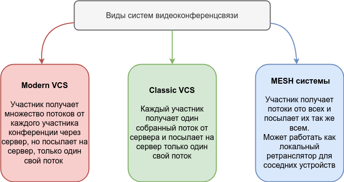

# Варианты многопользовательских систем видеоконференцсвязи

По внутреннему устройству многопользовательские системы видеоконференций можно разделить на три вида:

## Классическая схема 
Клиенты шлют по несколько потоков (видео, звук, показ экрана) на сервер, сервер собирает все потоки в один и отправляет каждому участнику по два потока - видео от всех в одной картинке и звук от всех исключая самого зрителя (Это кстати, заставляет сервер собирать N звуковых потоков).

По этому принципу работают системы, ориентированные на аппаратные терминалы, IP телефоны и подобное оборудование работающее по протоколам SIP или H323.
Из продуктов можно выделить: Polycom RMX, Tandberg MCU и подобные, а также Open Source проект OpenMCU.

Плюсы данной схемы:

 - Минимальная на нагрузка на сеть и клиентские устройства
 - Удобно делать запись
 
Минусы:

 - Требуются вычислительные мощности сервера
 - Невозможно создать индивидуальную раскладку на участнике (если не кодировать для каждого индивидуальное видео)
 - Невозможно отключить воспроизведение звук или видео от какого-либо участника локально

## Современная схема 
Клиенты шлют по несколько потоков (видео, звук, показ экрана) на сервер, который в свою очередь, без перекодирования и прочих манипуляций с содержимым, просто ретранслирует каждый поток на каждого подписанного на него участника конференции.