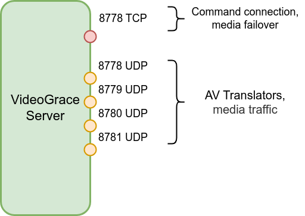
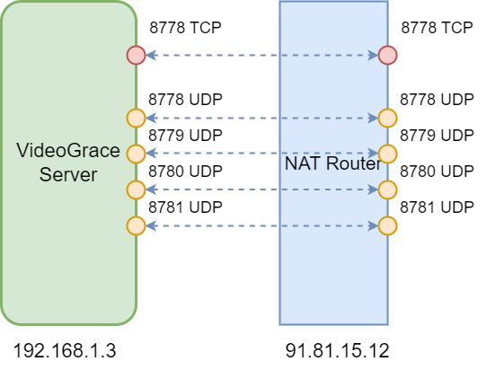

# Обеспечение доступности сервиса
Для того, чтобы клиенты могли подключиться к серверу, звонить/проводить конференции нужно обеспечить 
сетевую доступность сервиса.

## Принцип работы

Сервис слушает один TCP порт, на котором отдается сервисный вебсайт (панель управления сервером, страницы конференций), а также через websocket подключаются клиенты.
В случае недоступности UDP портов, AV трафик также будет передаваться через этот порт.

Передача AV трафика производится на некотором множестве UDP портов, каждый такой порт обслуживается AV транслятором сервиса.
Для проведения видеоконференций с большим числом участников, нужно что-бы число этих AV трансляторов было не меньше числа ядер процессора машины на которой выполняется сервис.
Например, для проведения конференции на 100 одновременных участников желательно не менее 16 AV трансляторов.

## NAT
В случае, если сервер находится внутри сети, за NAT роутером, для подключения внешних клиентов, требуется
пробросить все порты, с теми же номерами на роутере.

Далее: [Подключение клиентов к системе](client_connect.md)