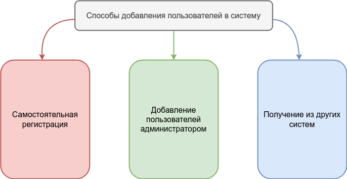

# Подключение клиентов к системе видеоконференцсвязи

## Способы добавления пользователей

Существует три способа получения учетной записи пользователя в системе:
 
 - Самостоятельная регистрация пользователя
 - Создание учетных записей администратором сервиса и выдача их пользователю
 - Загрузка списка пользователей из другой системы

## Самостоятельная регистрация пользователей
Самостоятельная регистрация возможна если в настройках сервера, в разделе 

    Пользователи
    
включено 

    Разрешить самостоятельную регистрацию пользователей

Чтобы пользователи сразу подключились к вашему серверу без необходимости ввода его адреса,
сервисом предоставляется инсталлятор клиентского приложения с зашитым в имени файла адресом вашего 
сервера, на странице:

    http://<адрес_вашего_сервера>:8778/install

Эта страница доступна всем пользователям и не требует авторизации в панели администратора сервера.

У такого способа подключения пользователей есть минусы:

 - Пользователи могут ввести некорректные имена
 - У клиентов нет общего списка пользователей, им нужно добавлять контакты самостоятельно, через поиск

## Создание учетных записей администратором
...

## Загрузка пользователей из другой системы
...
