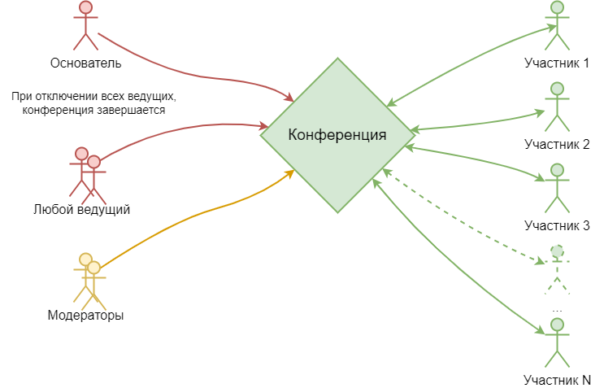

# Проведение видеоконференций

Технически, прямой звонок любому контакту из списка, эта такая же групповая конференция как и конференция с именем, ссылкой и добавленными в нее участниками. Это значит, что во время любого видеозвонка, можно добавлять любое количество участников к этому звонку, таким образом, многопользовательская конференция доступна всегда, когда потребуется.

## Время жизни конференции

Видеоконференция длится пока к ней подключен ее создатель или хотя-бы один другой ведущий.

Если установлен флаг "Автоматически подключать участников при подключении ведущего" участники будут автоматически добавляться в конференцию все то время, что к конференции подключен хотя-бы один ведущий.

## Флаги конференции

Для упрощения работы модератора у конференции имеются флаги:

---
Эти флаги упрощают модерацию и позволяют снизить трафик:

* Выключать микрофоны участников когда они не берут слово
* Выключать камеры участников когда они не берут слово

---
Если участники забывают что-то включить:

* Включать камеры участников при подключении
* Включать микрофоны участников при подключении

---
Для наиболее ответственных мероприятий:

* Запретить участникам самостоятельно брать слово
* Запретить участникам самостоятельно включать микрофон
* Запретить участникам самостоятельно включать камеру

* Включать камеру/микрофон участника не спрашивая
* Выключить вывод говорящего участника в главное окно
* Запретить участникам запись

---
Конференция будет проводиться только при подключении ведущего:

* Автоматически подключать участников при подключении ведущего
* Запретить участникам самостоятельное подключение к этой конференции

---

## Виды конференций

Существует три вида конференций:

### Симметричная (все видят всех)

Основной режим для небольших конференций. До 100 участников, в зависимости от потребности и возможностей сети и оборудования.

### Асимметричная (все видят ведущего и выступающих)

Видеоселектор, у всех кроме ведущих при подключении "отнято слово" и участники не видят друг друга. Тот участник который получает слово становится видным всем. Ведущие всегда видят и слышат всех.

Незаменима, когда нужно провести большое мероприятие с большим (тысячи) числом зрителей.

### Асимметричная с симметричным звуком

Почти тоже самое, только всем слышно друга друга всегда.
