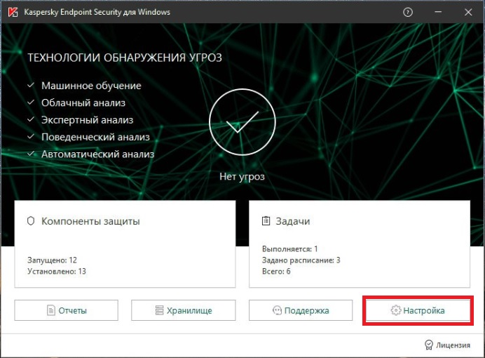

# Настройка продуктов Лаборатории Касперского для обеспечения доступа к камере

Антивирус Касперского может блокировать доступ приложений к устройствам записи аудио и видео. Это вызовет проблемы в работе проектов, в которых задействована web-камера или микрофон. 

Приложение VideoGrace Client по умолчанию добавляется антивирусом в группу «Слабые ограничения». В данной группе у программ заблокирован доступ к веб-камере и устройствам аудиозаписи.

В Kaspersky Endpoint Security отсутствует уведомление о данном действии антивируса, в Kaspersky Total Security появляется запрос действия пользователя.

Для решения данной проблемы требуется перенести программы в группу «Доверенные», что откроет для них доступ к камере и микрофону.

## Настройка Kaspersky Endpoint Security

На главном экране нажмите «Настройки»

В настройках KES перейдите в раздел «Продвинутая защита» (1), выберите пункт «Предотвращение вторжений» (2), нажмите на кнопку «Программы»

В списке нажмите правой кнопкой мыши на “VideoGraceClient.exe” (4), выберите пункт «Переместить в группу» (5), затем «Доверенные» (6) и нажмите «Ок» (7), затем «Сохранить» (8).

После этого ограничения будут сняты и приложения получат необходимый доступ

## Настройка Kaspersky Total Security

На главном окне нажмите «Больше функций»

Нажмите на панель «Контроль программ»

Нажмите «Управление программами»

Нажмите правой кнопкой на “VideoGraceClient.exe”, выберите «Ограничения» и «Доверенные».

После этого ограничения будут сняты и приложения получат необходимый доступ.
