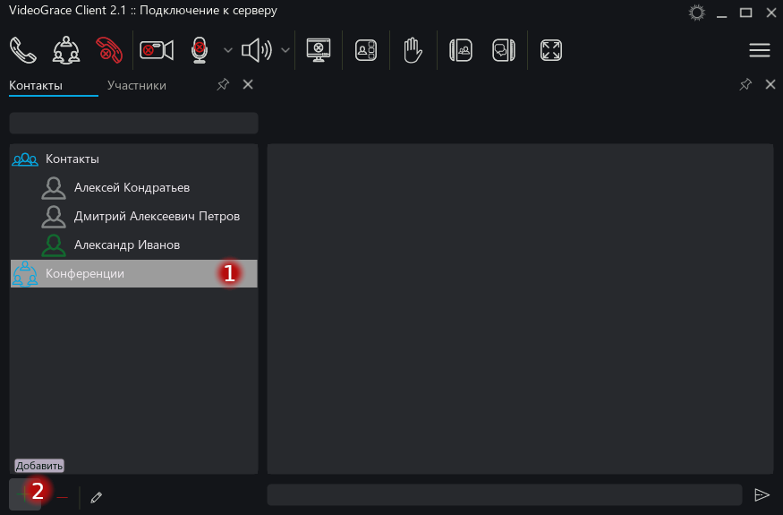
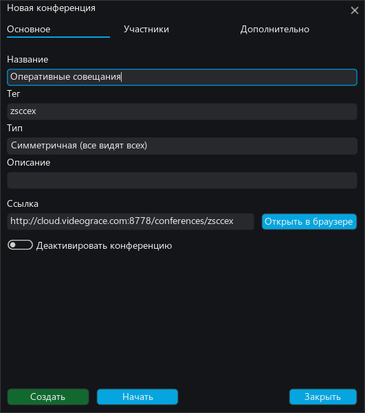
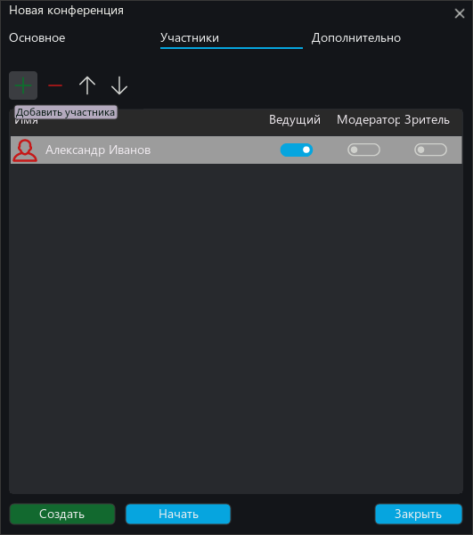
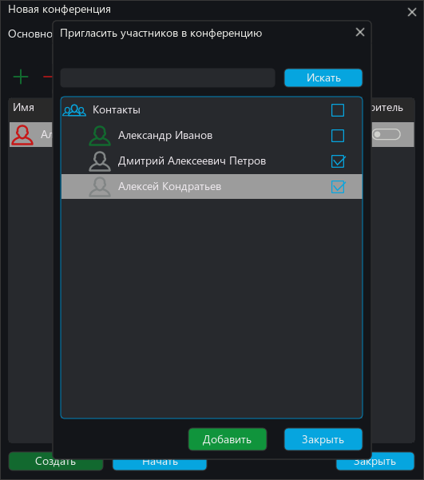
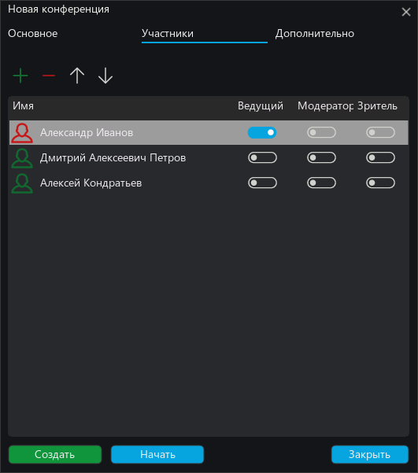
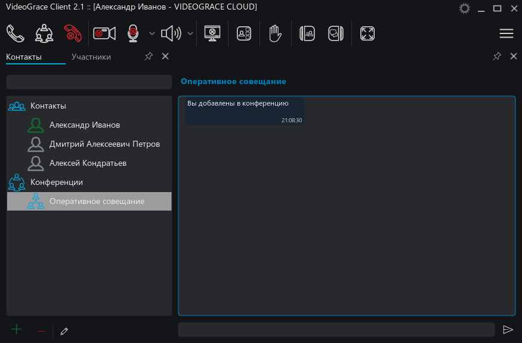
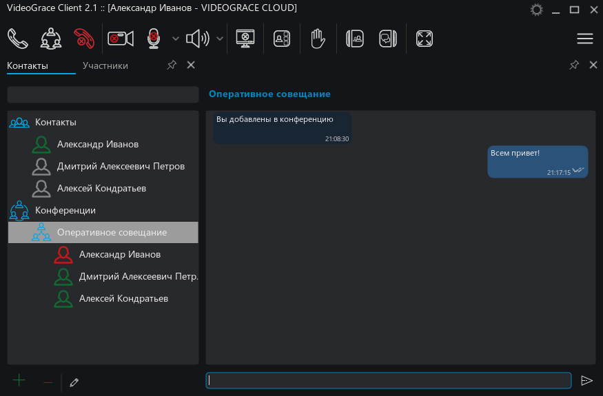

# Создание конференций

Создание конференций возможно как на сервере через панель управления так и в клиентском приложении при наличии разрешения пользователю создавать и редактировать конференции.

## Создание конференции из приложения

Выберите в списке "Конференции" (1) и нажмите "Добавить" (2)

В открывшемся диалоге достаточно ввести название конференции и разослать ссылку всем контрагентам

Так же можно сразу добавить пользователей из вашего списка контактов в конференцию. Для этого, нажмите "Участники" и кнопку "Добавить участника"

В появившемся списке, выберите добавляемых в конференцию пользователей и нажмите "Добавить"

В завершении, нажмите "Создать" и конференция будет создана и добавлена в списки контактов участников

## Использование конференции

Теперь вам, и добавленным участникам, видно эту конференцию у себя в списке

Конференция предоставляет групповой чат с гарантией доставки на все устройства каждого участника

У вас, как у создателя, конференция имеет синий значок, у остальных участников - серый
При нажатии на нее, показывается список участников.
Цвет значков здесь означает ранг участника:

- красный - владелец
- желтый - модератор
- зеленый - обычный участник
- серый - зритель, может только смотреть

Проведение видеоконференций описано в [следующем разделе](../conferencing/start.md)
