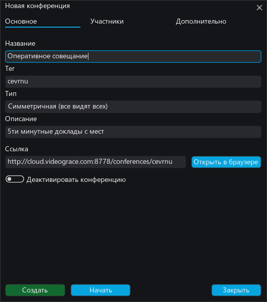

# Создание конференций

Создание конференций возможно как на сервере через панель управления так и в клиентском приложении при наличии разрешения пользователю создавать и редактировать конференции.

## Создание конференции из приложения

Выберите в списке "Конференции" (1) и нажмите "Добавить" (2)

В открывшемся диалоге достаточно ввести название конференции и разослать ссылку всем контрагентам

Так же можно сразу добавить пользователей из вашего списка контактов в вашу конференцию. Для этого, нажмите "Участники" и кнопку "Добавить участника"

В появившемся списке выберите добавляемых в конференцию пользователей и нажмите "Добавить"

В завершении, нажмите "Создать" и конференция будет создана и добавлена списки контактов участников.

При нажатии на "Начать" конференция запустится
