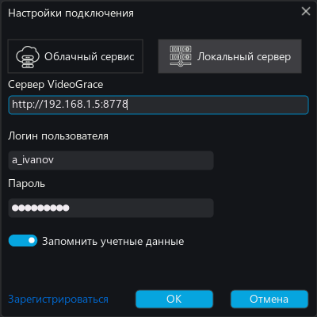
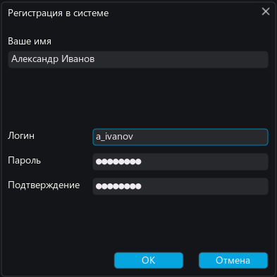

# Подключение к сервису

## Технические требования
Для работы с системой видеоконференцсвязи необходима связь с сервером VideoGrace посредством IP сети.
Ширина канала зависит от числа участников и настроек качества, минимальный канал для звонков 1 на 1
64 кб/c c видео и 8 кб/c только звук. Для нормального участия в конференции на 10 участников с качеством 
видео 480p достаточно ADSL или 3G канала. Проведение больших конференций на 100 и более участников 
потребует полноценного Ethernet 100 / 4G канала.

## Установка адреса сервера

Вы можете подключиться как к публичному облаку cloud.videograce.com так и к частному серверу
адрес которого вам известен. Если вам прислали ссылку или файл инсталлятора, в его имени уже зашит
правильный адрес сервера, не меняйте его.

## Учетные данные

На некоторых серверах, например в облаке VideoGrace_Cloud разрешена самостоятельная регистрация,
в таком случае, вы можете нажать ссылку "Регистрация" в диалоге подключения и зарегистрироваться 
введя Имя, Логин и Пароль с подтверждением. Если логин не занят, произойдет регистрация на сервере,
а приложение запомнит эти данные для последующих подключений.

В случае, если на сервере закрыта регистрация, логин и пароль вам должен выдать администратор сервера.
Эти учетные данные, как и адрес сервера, также могут быть зашиты в имя файла инсталлятора, тогда
диалог подключения даже не появится и вы сразу подключитесь к серверу под своей учетной записью.

Если вы получили инсталлятор со страницы конференции, то после установки, клиент проведет автоматическую 
регистрацию с именем введенным на странице, логин и пароль будут сгенерированы автоматически. Их можно изменить
в настройках приложения "Учетная запись".
