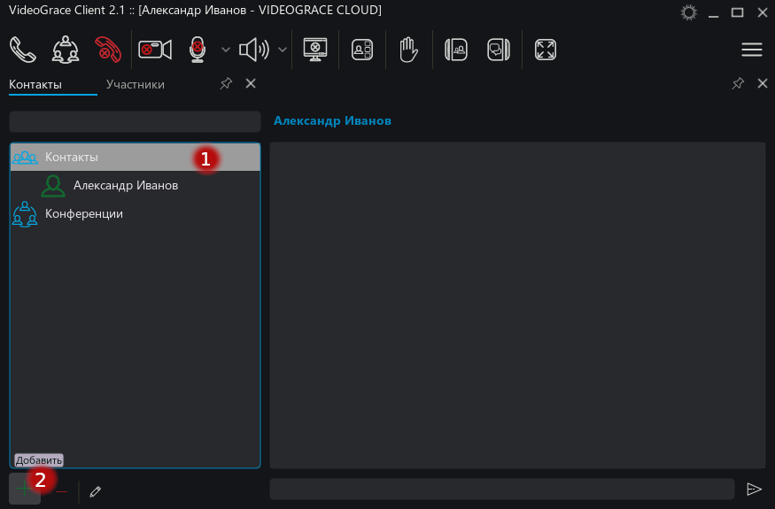
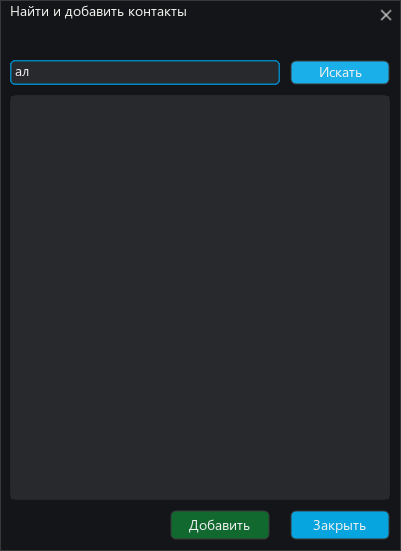
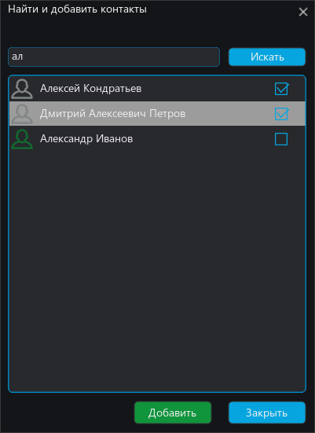
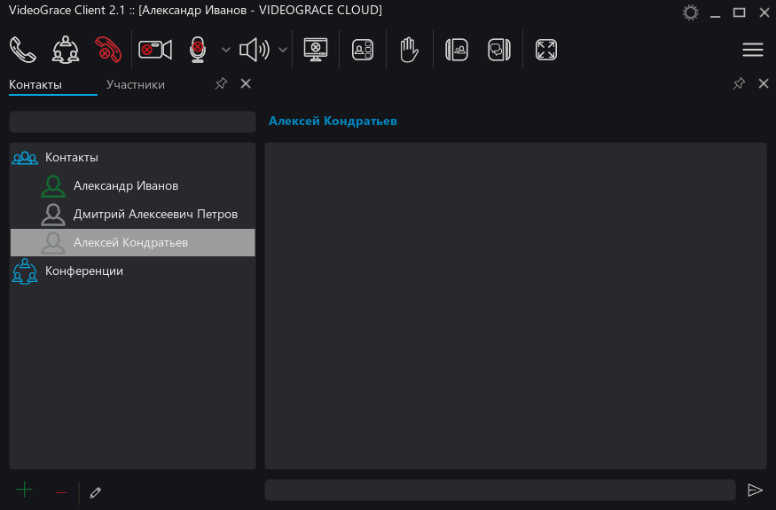

# Добавление контактов

Система позволяет создавать как централизованный список контактов с разбивкой на группы, так и персональные списки  каждого пользователя. Создание централизованного списка описано в руководстве администратора сервера, далее будет показано добавление пользователей через поиск в личный список контактов.

## Личный список контактов

Для добавления пользователя по имени через поиск, выберите "Контакты" (1) и нажмите "Добавить" (2)

В открывшемся диалоге введите имя пользователя и нажмите "Искать"

В появившемся списке проставьте галочки у тех пользователей что вы хотите добавить и нажмите "Добавить"

В результате пользователи будут добавлены в ваш список контактов:

Теперь вы можете звонить, писать и [собирать конференции](conference.md) с этими пользователями.
